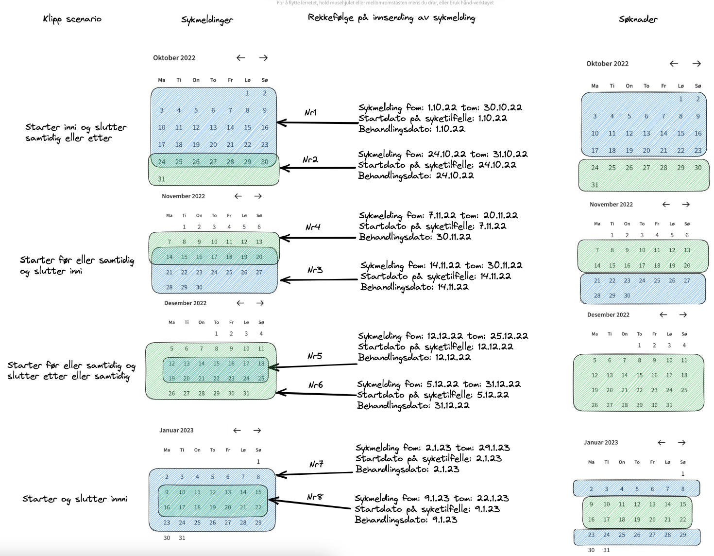

# Sykepengesoknad-backend

Sykepengesoknad-backend tilbyr et API mot frontenden for å hente og gjøre operasjoner på sykepengesøknader. Videre legger den søknader på kafka-topics ved spesielle hendelser. (som opprettet, sendt osv.) Disse kan bli plukket opp av andre apper bakover i løypa som f.eks sykepengesoknad-narmeste-leder-varsel. 

___

## Funksjoner

### Søknadsopprettelse

Når en sykmelding blir bekreftet i *Dine sykmeldinger*, blir den sendt til denne applikasjonen via kafka.
Når vi mottar sykmeldingen opprettes tilhørende søknader.

Dersom sykmeldingen inneholder perioder som overlapper med en tidligere sykmelding blir dette håndtert slik ([overlappende sykmelding](#overlappende-sykmeldinger))

Har sykmeldingen en varighet på over 31 dager splittes denne opp i flere søknader ([hvordan sykmeldinger splittes til søknader](#splitting-av-sykmeldinger))

### Søknadsutfylling

En sykmeldt som kommer inn i frontenden ([sykepengesoknad-frontend](https://github.com/navikt/sykepengesoknad-frontend)) vil få søknader tilknyttet til seg hentet.
Sendte og fremtidige søknader samt søknader til utfylling blir hentet til visning i frontenden. Når den sykmeldte
går inn på en spesifikk søknad til utfylling, vil det gjøres kall inn til `sykepengesoknad-backend` for å oppdatere svarene tilknyttet
den søknaden i databasen.

### Sending av søknad

Når en sykmeldt fullfører utfylling av en søknad, vil `sykepengesoknad-backend` sende dette videre til de partene som vil ha den.
Søknaden blir publisert på Kafka-topic; `flex.sykepengesoknad`

`sykepengesoknad-backend` følger også med på et Kafka-topic for personhendelser, spesifikt for å oppdage når en person tilknyttet
sykepengesøknader har dødd. Disse søknadene blir automatisk sendt (og publisert på Kafka), med en merknad om at søknaden er sendt på
grunn av dødsfall.

### Overlappende sykmeldinger

Det er den nyeste sykmeldingen som er skrevet av legen som skal brukes av den sykmeldte for å søke om sykepenger.
Når legen eller legene skriver sykmeldinger som har overlappende perioder tilpasser vi periodene i søknadene.

Det finnes 4 forskjellige scenarior av overlappende sykmeldinger.
Den blå perioden er en tidligere sykmelding og den grønne er den nyeste og gjeldene.
Tilpasningene gjøres på søknadene og sykmeldingen beholder sine orginale perioder.

### Splitting av sykmeldinger

La oss ta et eksempel på en sykmelding med følgende perioder:

* Fra 1. april til 14. april er man sykmeldt med 100% fravær
* Fra 15. april til 28. april er man sykmeldt med 60% fravær
* Fra 29. april til 3. mai er man sykmeldt med 20% fravær

I `sykepengesoknad-backend` regnes totalt antall dager for denne sykmeldingen ved å ta første
fra-og-med-dato (1. april), og siste til-og-med-dato (3. mai): 32 dager.

Antall deler (altså, antall søknader som skal opprettes for denne sykmeldingen) blir regnet
ved å dele 32 dager med 31, og **runde opp** til nærmeste runde tall: 2 søknader.
Søknader overskrider dermed aldri 31 dager.

Grunnlengden til hver søknad blir regnet ved å dele 32 dager med antall deler og **runde ned** til nærmeste runde tall:
16 dager per søknad.

Hvis det er noen restdager igjen etter det vil det bli delt ut til søknadene, men i dette tilfellet deles søknadene rent i to.

**_Måten restdager blir delt ut på kan forklares med noen søknader som deles i 3:_**

    | Sum av sykmeldingsperioder | Søknad 1 | Søknad 2 | Søknad 3 |
    |----------------------------|----------|----------|----------|
    | 63 dager                   | 21 dager | 21 dager | 21 dager |
    | 64 dager                   | 22 dager | 21 dager | 21 dager |
    | 65 dager                   | 22 dager | 22 dager | 21 dager |
    | 66 dager                   | 22 dager | 22 dager | 22 dager |

Denne splittinga skjer uavhengig av hvordan sykmeldingsperiodene er delt opp.

Det endelige resultatet vil derfor være som følger:

* Første søknad vil omhandle første 14 dager med 100% fravær, og 2 dager med 60% fravær.
* Andre søknad vil omhandle de neste 12 dagene med 60% fravær og de siste 4 dagene med 20% fravær.

**_Her er en mer komplett tabell over hvordan søknader splittes.:_**

    | Sykmeldingslengde | Søknadslengder   |
    |:-----------------:|:-----------------|
    |        31         | [31]             | 
    |        32         | [16, 16]         | 
    |        33         | [17, 16]         | 
    |        34         | [17, 17]         | 
    |        35         | [18, 17]         | 
    |        36         | [18, 18]         | 
    |        37         | [19, 18]         | 
    |        38         | [19, 19]         | 
    |        39         | [20, 19]         | 
    |        40         | [20, 20]         | 
    |        41         | [21, 20]         | 
    |        42         | [21, 21]         | 
    |        43         | [22, 21]         | 
    |        44         | [22, 22]         | 
    |        45         | [23, 22]         | 
    |        46         | [23, 23]         | 
    |        47         | [24, 23]         | 
    |        48         | [24, 24]         | 
    |        49         | [25, 24]         | 
    |        50         | [25, 25]         | 
    |        51         | [26, 25]         | 
    |        52         | [26, 26]         | 
    |        53         | [27, 26]         | 
    |        54         | [27, 27]         | 
    |        55         | [28, 27]         | 
    |        56         | [28, 28]         | 
    |        57         | [29, 28]         | 
    |        58         | [29, 29]         | 
    |        59         | [30, 29]         | 
    |        60         | [30, 30]         | 
    |        61         | [31, 30]         | 
    |        62         | [31, 31]         | 
    |        63         | [21, 21, 21]     | 
    |        64         | [22, 21, 21]     | 
    |        65         | [22, 22, 21]     | 
    |        66         | [22, 22, 22]     | 
    |        67         | [23, 22, 22]     | 
    |        68         | [23, 23, 22]     | 
    |        69         | [23, 23, 23]     | 
    |        70         | [24, 23, 23]     | 
    |        71         | [24, 24, 23]     | 
    |        72         | [24, 24, 24]     | 
    |        73         | [25, 24, 24]     | 
    |        74         | [25, 25, 24]     | 
    |        75         | [25, 25, 25]     | 
    |        76         | [26, 25, 25]     | 
    |        77         | [26, 26, 25]     | 
    |        78         | [26, 26, 26]     | 
    |        79         | [27, 26, 26]     | 
    |        80         | [27, 27, 26]     | 
    |        81         | [27, 27, 27]     | 
    |        82         | [28, 27, 27]     | 
    |        83         | [28, 28, 27]     | 
    |        84         | [28, 28, 28]     | 
    |        85         | [29, 28, 28]     | 
    |        86         | [29, 29, 28]     | 
    |        87         | [29, 29, 29]     | 
    |        88         | [30, 29, 29]     | 
    |        89         | [30, 30, 29]     | 
    |        90         | [30, 30, 30]     | 
    |        91         | [31, 30, 30]     | 
    |        92         | [31, 31, 30]     | 
    |        93         | [31, 31, 31]     | 
    |        94         | [24, 24, 23, 23] | 
    |        95         | [24, 24, 24, 23] | 
    |        96         | [24, 24, 24, 24] | 
    |        97         | [25, 24, 24, 24] | 
    |        98         | [25, 25, 24, 24] | 
    |        99         | [25, 25, 25, 24] | 
    |        100        | [25, 25, 25, 25] | 

## Redis
Sykepengesoknad-backend bruker redis for cache. Denne deployes ved endringer i redis-config.yaml av en egen GHA workflow.

## Data
Sykepengesoknad-backend har en postgres database. Her lagres alle søknadene strukturert.
Søknadene inneholder, spørsmål, svar, status og identifikator på personen søknaden hører til.
Det er ikke noe sletting av søknader fra denne databasen, når søknader utløper etter 4 måneder endres kun statusen, data ligger der fortsatt.

Databasen lagrer også dødsmeldinger som kommer inn på personer som har en søknad.
Denne dødsmeldingen ligger lagret i 2 uker før den slettes samtidig som NYe søknader automatisk sendes inn.

Ved endring av status på søknad så publiserers også hele søknaden på Aiven kafka slik at andre apper kan lese dataene.
Dette kafkatopicet lagrer dataene i 6 måneder etter publisering.

___

# Komme i gang

Bygges med gradle. Standard spring boot oppsett.

---

# Henvendelser

Spørsmål knyttet til koden eller prosjektet kan stilles til flex@nav.no

## For NAV-ansatte

Interne henvendelser kan sendes via Slack i kanalen #flex.
